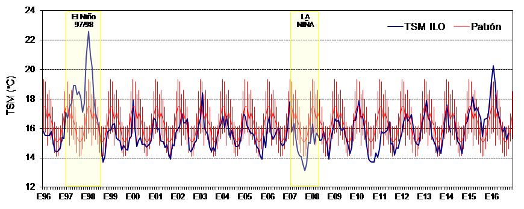

## INTRODUCCIÓN

En concordancia con el Convenio de Colaboración Científica y Técnica firmado en Lima, Perú en 1992, entre el Instituto del Mar del Perú (IMARPE) y el Instituto de Fomento Pesquero de Chile (IFOP), se realizó el Décimo Cuarto Taller de Evaluación Conjunta del Stock de Anchoveta del Sur del Perú y Norte de Chile. Esta actividad contó con el apoyo del Proyecto GEF-Humboldt.

El presente informe contiene los resultados de la Evaluación Conjunta, así como recomendaciones de actividades a ser realizadas por cada Instituto. Este documento tiene el carácter de preliminar y está sujeto a ratificación por las autoridades de ambos Institutos.  El área de estudio del presente trabajo abarcó entre el 16 y 24°S.


## GRUPO DE TRABAJO

El trabajo fue desarrollado por las siguientes personas:

```{r echo=FALSE, results = "hide", message = FALSE, warning=FALSE}
library(knitr)
```

```{r echo=FALSE, results = "asis"}
listPar = read.csv("ListaParticipantes.csv")
kable(x = listPar, caption = "Lista de participantes.")
```

## CONDICIONES OCEANOGRÁFICAS

### Climatología de la Temperatura Superficial del Mar (TSM)

Al analizar la serie de TSM de la estación de Ilo se distingue claramente la ocurrencia de los eventos El Niño 1997-1998 (periodo durante el cual se registró una TSM máxima de 22.6 °C) y 2015-2016 (periodo durante el cual se registró una TSM máxima de 20.3 °C), así mismo, también se distinguen eventos fríos en los años 1998 (con una TSM mínima de 13.7 °C), 2007 (con una TSM mínima de 13.1 °C) y 2010 (con una TSM mínima de 13.7 °C). Desde la segunda mitad de 2016 la TSM viene registrando valores cercanos al patrón (Figura \ref{fig1}).



En el sur de Perú y norte de Chile la distribución de la TSM muestra un rango entre 25 y 16°C con un decaimiento latitudinal y zonal, asociados a la disminución de la radiación solar hacia el sur y la presencia de una banda costera de aguas de menor temperatura producto de permanentes surgencias costeras (Figura \ref{fig2}). Las mayores TSM se observan entre los meses estivales (Diciembre-Abril) y las menores en meses invernales (Julio -Septiembre) con estaciones de transición de primavera (Septiembre-Diciembre) y Otoño (Mayo-Junio). La banda costera se mantiene durante todo el año, aunque el gradiente zonal se fortalece entre primavera y verano debido a las mayores TSM en el Océano y la intensificación de la surgencia en la costa forzada por el aumento de la componente del viento que favorece la surgencia.  


Dentro de la distribución de TSM cabe señalar la zona del codo de peruano-chileno, muestra una dinámica particular asociada a un núcleo oceánico de mayor temperatura permanente y una zona de transición entre zonas de surgencia de Chile y sur de Perú. En esta dinámica el cambio de dirección de los vientos por efecto topográfico puede estar jugando un rol preponderante lo que también se ve reflejado en las corrientes superficiales y profundas. 

### Climatología de las corrientes

Las corrientes muestran patrones estacionales al igual que las distribuciones de TSM y viento (Figura \ref{fig3}). Desde diciembre y desde la banda costera las principales corrientes promedio comienzan a fluir hacia el norte en la medida que se incrementa el viento cerca del continente. Por otro lado, en la época invernal cuando la intensidad del viento se debilita cerca del continente las corrientes se debilitan y forman meandros y remolinos, incluso se favorece el trasporte hacia el sur en la zona oceánica. En la zona del codo de Arica, las corrientes aparecen débiles casi en todo el año, excepto a partir de junio cuando se forma un remolino ciclónico que se desprende de la costa y permanece en el eje meridional de los 72°W hasta el mes de septiembre.


## PESQUERÍA

```{r message = FALSE, warning = FALSE, echo = FALSE}
library(r4ss)
source("getSummaryOne_fun.R")
```


### Desembarques

Durante el año 2015, el desembarque de anchoveta correspondiente de manera agregada al sur del Perú y norte de Chile fue de 0.809 millones t. Esta cifra fue 32% menor a la registrada en 2014 (1.246 millones t) y 36% inferior al promedio 1980-2014 (1.259 millones t). El rango inter-cuartílico de los desembarques registrados durante todo este periodo fue definido por los valores Q1 (25% de los datos) = 0.781 millones t y Q3 (75% de los datos) = 1.704 millones t, mientras que la mediana fue estimada en Q2 (50% de los datos) = 1.158 millones t. El año con el nivel de desembarque más alto fue 1994 con 2.794 millones t, mientras que en dicho año, junto con 1989, 1992, 1995, 1997, 2002, 2004, 2007 y 2011, se superó el Q3. Por el contrario, el año con el nivel más bajo de desembarque fue 1983 con solo 390 t, mientras que en dicho año, junto con 1980, 1982, 1984, 1985, 1987, 1990, 1998 y 2003, no se alcanzó el Q1 (Tabla 1, Figura 4).

En la región sur del Perú, desde el 2003 al 2008, la tendencia de los desembarques fue creciente en el primer trimestre del año, asociado al incremento del esfuerzo pesquero debido a las vedas impuestas en la región Norte-Centro (Bouchon et al. 2008). Durante el 2009 el patrón estacional cambió, observándose las mayores capturas en los últimos meses del año.
```{r message = FALSE, warning = FALSE, echo = FALSE, results = 'hide'}
tmp2 = SS_output(dir = "models/mod_B")
```

```{r fig.cap = "Desembarques de anchoveta por año en el sur de Perú (Fish_Per) y norte de Chile (Fish_Chi).", echo = FALSE, message = FALSE, results = 'hide', fig.height=3.5}
par(mar = c(2,4,1,1))
SSplotCatch(replist = tmp2, subplots = 11, labels=c("Harvest rate/Year",  #1
             "Continuous F",              #2
             "Desembarques",                  #3
             "Total catch",               #4
             "Predicted discards",        #5
             "Discard fraction",          #6  # need to add by weight or by length
             "(t)",                      #7
             "(numbers x1000)",           #8
             "Observed and expected",     #9
""), xlab = "")
```

En la zona norte de Chile, la pesquería de pequeños pelágicos, ha presentado 3 períodos: el primero de 1955 a 1976, basado casi exclusivamente en la extracción de anchoveta (\textit{Engraulis ringens}), donde se observó un crecimiento sostenido del recurso hasta 1966 alcanzando 1,1 millones de toneladas (ton), para luego registrar una fuerte reducción de las capturas (promedio 1967-1972 de 540 mil ton), siendo más notable posterior al evento El Niño 1972-73, con niveles promedio de 330 mil ton (1974-1976). El segundo período comienza a mediados de la década del 70 y corresponde a una etapa de bajas capturas de anchoveta y un aumento notable en la abundancia de sardina española (\textit{Sardinops sagax}), especie que sostuvo la pesquería hasta fines de la década del 80 con capturas promedio de 1,8 millón de ton entre 1978 y 1989. El tercer periodo se establece desde mediados de los 80 y se caracteriza por una mayor abundancia y estabilización en las capturas, las que se nivelan en torno a los 1,3 millones de ton, cifra que fue disminuyendo para promediar las 600 mil ton en el período 2006-2016. La anchoveta representa más del 80% de las capturas, seguida por jurel y caballa.

```{r echo=FALSE, results = "asis"}
listDesem = read.csv("DesembarqueAnual.csv")
kable(x = listDesem, caption = "Desembarques de anchoveta (ton) por año en el sur del Perú y norte de Chile.")
```

### Estacionalidad de los desembarques

El patrón estacional de captura de anchoveta para la zona sur del Perú y norte de Chile indica que los mayores desembarques se producen en el primer semestre. En el sur del Perú las capturas se producen principalmente en el verano y asociadas a un incremento del esfuerzo pesquero, debido a desplazamientos de la flota de la región norte-centro del Perú en épocas de veda. Asimismo, informaciones de cruceros, indican mayor disponibilidad de anchoveta durante el primer semestre en la región sur. En la zona norte de Chile, temporalmente las capturas se concentran en el primer semestre (50 a 60%), el segundo semestre la actividad es reducida principalmente por veda reproductiva (agosto - septiembre), escaso ambiente de pesca y/o paralización voluntaria de la flota por presencia de juveniles (Figura \ref{fig5}).


### Áreas de pesca

La distribución espacial de las áreas de pesca se analizó para el Sur de Perú para los años 2015 y 2016. Se observó que la flota operó latitudinalmente a lo largo de la región Sur y dentro de las 90 mn. Para el primer trimestre de 2015, la distribución espacial del esfuerzo pesquero estuvo concentrada dentro de las 30 mn. Durante el segundo y tercer trimestre la flota desplegó un mayor esfuerzo de pesca, concentrándose principalmente dentro de las 50 mn y a los largo de la región. Para 2016, se observó un patrón similar pesca al 2015 durante el segundo trimestre, mientras que para el tercer trimestre la flota amplió su esfuerzo pesquero, el cual se vio ampliado hasta las 90 (Figura \ref{fig6}). Para la zona norte de Chile se destacan tres áreas principales de pesca situadas frente a los puerto de operación 1) frente al puerto de Arica, 2) entre Iquique y la desembocadura del río Loa, 3) Bahía de Mejillones y Antofagasta. La distribución espacial de las capturas de anchoveta se registra principalmente entre la costa y las 20 millas de la costa, alcanzando eventualmente más allá de las 60 millas al norte de la zona de estudio durante el invierno austral. Esta distribución muestra dos periodos, antes del 2006 se destacan dos sectores de concentración, el primero ubicado en el extremo norte de la zona de estudio y el segundo localizado entre los 20º y 22º S. Con posterioridad al 2006, localizado hacia el centro de la zona de estudio (20º a 22º S) tendió a desaparecer manteniendo su importancia relativa anual, pero con menores concentraciones, mientras que el sector en el extremo norte se mantuvo, pero disminuyó su extensión latitudinal. (Figura \ref{fig7}).


### Composición por tallas de los desembarques

En general, las tallas de anchoveta han variado entre 7 y 18,5 cm, observándose antes de 1999 estructuras multimodales con grupos centrados en juveniles menores a 11 cm y adultos hasta 17 cm; posterior a 1999 los juveniles tienden a desaparecer de las capturas y se reduce la talla máxima, registrándose en los años 2015 y 2016, tallas que no superaron los 17 cm. En general, las estructuras de anchoveta están conformadas por ejemplares adultos (> 12 cm), con un aporte de reclutas bajo y escasa presencia de ejemplares juveniles (años 2003, 2006, 2009 y 2010). La estructura por tamaños de anchoveta en el periodo 2005 - 2009, muestra diferencias en los grupos modales de las capturas en ambas pesquerías. La moda de los adultos en la pesquería del Perú es en general 1 ó 2 centímetros menor que en el norte de Chile. Durante el 2009, la composición por tamaños fue mayormente adulta. En el sur del Perú, se observó el ingreso de reclutas, principalmente entre diciembre del 2008 a febrero del 2009, lo cual generó la presencia de individuos adultos el resto del año (Figura 7).


## DINÁMICA POBLACIONAL BASADA EN CRUCEROS

### Evaluación hidroacústica del reclutamiento de la anchoveta en la XV, I y II Regiones (RECLAN)

Se presentaron los resultados de tamaño y distribución del stock de anchoveta estimado en cruceros de evaluación directa realizadas entre los años 1996-2002 y 2007-2016 en la zona comprendida desde el límite norte de Chile hasta la latitud 24°40´S hasta una distancia de 20 millas náuticas de la costa. Los cruceros de prospección de tipo ecosistémico se han desarrollado a bordo del BI Abate Molina (Figura 8), contándose además con la participación de una embarcación artesanal de bajo calado, que opera en el sector más costero comprendido entre las latitudes 21° y 22°S. El BI Abate Molina está equipado con un sistema acústico marca Simrad EK60 con transductores de frecuencias de 18, 38, 120 y 200 kHz, y la lancha artesanal con un sistema EK60 con un transductor de 38 kHz.  Ambos sistemas son calibrados previos al inicio del estudio según las recomendaciones de su fabricante.

En la Figura 9a se muestra el plan de muestreo del crucero, este ha consistido en una red de 40 transectas perpendiculares a la costa separadas por 10 millas náuticas entre cada una y muestreo dirigido al sector más costero mediante una lancha pesquera artesanal.  Mientras se desarrollan las transectas de muestreo acústico, se realizan lances de pesca de identificación con una red de mediagua en el BI Abate Molina y red de cerco en la nave artesanal. Además del muestreo acústico, se efectúan otras actividades asociadas a muestreos biológicos de los lances de pesca de identificación, muestreo oceanográfico y muestreo de fito y zooplancton (Figura 10).  Los muestreos oceanográficos cada dos transectas en estaciones realizadas a 1, 5, 10 y 20 millas náuticas.

Los datos acústicos son grabados en formato .raw y procesados mediante el software Echoview(R). El análisis de la información se realiza estratificando el área prospectada de acuerdo a la composición de la estructura de tallas observada en los lances de pesca (Figura 11), la relación TS = 20,89 x Log (L) - 74,548 y la relación longitud peso estimada para cada crucero.

\begin{align*}
\hat{A}_k=A\hat{C}_{nk}\hat{R}_k \\
\hat{B}_k=\hat{A}_{k}\hat{\overline{w}}_k \\
\hat{A}_T=\sum_k\hat{A}_{k} \\
\hat{B}_T=\sum_{k}\hat{B}_{k}
\end{align*}

siendo: $A_T$ la abundancia total, $A_k$ la abundancia a la talla $k$ (N°), A el área de distribución del recurso en el sector (mn2), $C_{nk}$ el coeficiente de ecointegración a la talla, $W_{k}$ el  peso medio a la talla, $B_t$ la biomasa total, $B_k$ biomasa a la talla $k$ y $R_k$ el estimador de la densidad acústica a la talla $k$ (SA).

Los resultados se entregan para cada estrato (Figura 12) y en ellos se incorporan la fracción de reclutas, el área de cada estrato, la densidad promedio y el aporte de cada estrato al estimado total de la zona prospectada.

La densidad acústica promedio se estima mediante el uso del método geoestadístico intrínseco, metodología que considera, a través de la estimación de un variograma, de la distribución espacial de los datos y su grado de correlación. La distribución espacial de la anchoveta se estima a partir de las densidades locales e interpoladas mediante el ponderador del inverso de la distancia al cuadrado (Figura 13).

Los resultados de la distribución muestran una disminución del área de distribución efectiva del recurso a partir del año 2011, asociado a una concentración más costera de la anchoveta en relación con la observada en la década anterior y es concordante con una distribución asociada a un periodo cálido. Los aspectos que podrían mejorar los resultados de este estudio, es efectuar mediciones de fuerza de blanco y disponer de embarcaciones de bajo calado, lo que permitiría incorporar pequeñas bahías y caletas al área de estudio.

### Método de Producción de Huevos (MPH) en el norte de Chile

En relación al monitoreo del stock desovante de anchoveta,  el  detalle  metodológico  respecto  a  las  estimaciones  de  producción  diaria  de huevos, área de desove, proporción de hembras, fracción diaria de hembras desovantes, fecundidad parcial y peso promedio de hembras se encuentra en Claramunt et al. 2013.

Entre agosto y septiembre del 2014 se realizó el crucero de método de producción de huevos (MPH), cuya estimación de biomasa desovante en base al estimador multinomial alcanzó un valor de 437 mil toneladas. En el año 2015 la estimación de biomasa desovante alcanzó las 525 mil toneladas en base al estimador multinomial y de 436 mil toneladas en base al estimador de Lo.

Para la caracterización de las zonas de desove se empleó la información generada a partir de muestras de zooplancton, las que se obtuvieron en el marco de 4 proyectos realizados en la zona  norte de Chile (18°25'S-26°00'S) cuyo extensión costa-océano (en dos de los cuatro casos)  abarco hasta las 100mn. Tanto la extensión de la serie de datos como los objetivos principales de cada proyecto fueron distintos (MPH, MOBIO, RECLAN, EV Jurel zona Norte) y la mayor parte ellos se efectuaron durante en el periodo de primavera-otoño de cada año.

Lo resultados describen la existencia Centros de Actividad Biológica (CAB), definidos como sectores específicos de la costa cuyos rasgos topográficos promoverían el desarrollo de una elevada actividad biológica de poca variación estacional. En este sentido se destacó la concordancia entre la distribución espacial exhibida por los máximos de abundancia de zooplancton y la mostrada por aquellos sitios donde la probabilidad de encuentro de huevos de anchoveta fue mayor (sitios de desove recurrentes), aspectos considerados como característicos de los CAB (Espíndola submitted).

Con el propósito de destacar la estabilidad en la dinámica local asociada a los CAB se describió la detección de huevos de anchoveta asociada a estas zonas, donde las condiciones de temperaturas y salinidad permanecieron comparativamente más bajas que en su entorno, pese a que las mediciones se hicieron dentro del periodo de mayor intensidad de EN 2015-16 a nivel ecuatorial (RECLAN Dic-2015). 

Finalmente se describió la variación temporal y espacial de la abundancia de huevos de anchoveta en tres estaciones de monitoreo en la zona norte de Chile durante el desarrollo EN 2015-16 y se destacó la detección de cambios en la distribución temporal y espacial de la abundancia de huevos empleando como parámetros de referencia (Series Mensuales de Referencia) la distribución promedio mensual y la proporción de huevos en las tres estaciones considerando solo los periodos neutros. En este contexto, la distribución mensual de huevos (SMR) en las estaciones de monitoreo se ajustó al patrón de corrientes descrito para zona de estudio.

Los cambios estuvieron dados por la detección de importantes pulsos reproductivos en los meses de verano (diciembre y febrero) y mayores abundancias de huevos hacia las estaciones ubicadas en el centro y sur de la zona de estudio, acorde a lo descrito en la  literatura. Adicionalmente, estas observaciones concordaron con distribución de huevos esperada en base a los resultados derivados del análisis discriminante, el que considero como variables explicativas de la distribución de huevos la temperatura y la salinidad. En este contexto se hiso referencia a las observaciones de campo en el marco del proyecto MPH 2014, donde se detectaron anomalías de salinidad superficial pero no de temperatura y la distribución de huevos se ajustó a la descrita por el modelo. 

La señal anual de SMR concordó con la señal de los índices gonadosomaticos (IGS) por lo que el monitoreo mensual de huevos recogería adecuadamente la señal anual del proceso reproductivo debido a la ubicación de las estaciones de monitoreo (en los CAB). Adicionalmente, la señal del proceso reproductivo de la anchoveta presento sincronía con la observada en otros componentes del ecosistema (zooplancton).
Se plantea la importancia del monitoreo permanente de las condiciones ambientales y sus consecuencias biológicas en los CAB, así como la promoción de estas estas zonas como sitios prioritarios para la conservación de los recursos hidrobiológicos.

### Estimación acústica de la biomasa de anchoveta en el sur de Perú

En el sur del Perú, la biomasa de anchoveta es estimada por el método acústico de acuerdo al procedimiento establecido en Castillo et al (2009). Los principales resultados que se obtiene como parte de este proceso son la abundancia por tallas del stock y la biomasa de la anchoveta. También se obtiene información sobre la biología reproductiva, condición somática, ecología trófica, edad y crecimiento. Adicionalmente se obtiene información sobre la biomasa de otras especies y sobre las condiciones oceanográficas del área evaluada.

En enero 2015, la biomasa de anchoveta en el sur de Perú fue estimada en 0.607 millones ton, cifra 2.5 veces superior a la registrada en el invierno del año anterior (0.244 millones ton) pero muy similar a la estimada en el verano de ese mismo año, además está cifra fue muy parecida al promedio de todas las estimaciones realizadas durante el periodo 1984-2014 (0.621 millones ton). 

El rango inter-cuartílico de los valores estimados durante todo este periodo fue definido por los valores Q1(25% de los datos)=0.192 millones ton y Q3(75% de los datos)=0.745 millones ton, mientras que la mediana fue estimada en Q2(50% de los datos)=0.502 millones ton. El periodo con el nivel de biomasa más bajo fue la primavera de 2008 con 2 mil ton, mientras que el periodo con el nivel de biomasa más alto fue el verano de 1995 con 2.668 millones ton (Figura \ref{fig14}).


## PARÁMETROS DE HISTORIA DE VIDA

### Edad y Crecimiento

La información referida a edad y crecimiento de la anchoveta del stock sur Perú-norte Chile da cuenta, para la fracción del stock del sur de Perú, de estimaciones de parámetros de crecimiento basados en la lectura de edad en años. Estos resultados muestran un crecimiento rápido (K=0,8) con una edad máxima de 3 años. Por el contrario, para la fracción del stock del norte de Chile, la validación y el análisis de la edad en días, muestra parámetros de crecimientos que indican un crecimiento muy rápido (K=1,09) edad máxima probable de 2 años (Tabla 2, Figura \ref{fig15}).

```{r echo=FALSE, results = "asis"}
listCrec = read.csv("ParamCrec.csv")
kable(x = listCrec, caption = "Parámetros de crecimiento von Bertalanffy convencional que ajusta la relación talla-edad (años) para el sur de Perú y von Bertalanffy estacional que ajusta la relación talla edad (días) para el norte de Chile.")
```

Estas diferencias hacen necesario trabajar en conjunto estudios que permitan replicar la validación de la edad, utilizando otolitos de la fracción del stock del sur del Perú, a partir del análisis de la microestructura de otolitos. Otro aspecto importante de revisar en conjunto es la determinación de unidades poblacionales, inicialmente a través de la aplicación de un estudio de morfometría de otolitos, con el propósito de determinar si existen diferencias significativas en la estructura de los stocks de Chile y Perú, en periodos fríos (NIÑA) y cálidos (NIÑO). Se siguiere realizar esta actividad durante el 2017, quedando la responsabilidad en los investigadores Carlos Goicochea (IMARPE) y Francisco Cerna (IFOP). En este mismo sentido IMARPE ofreció la posibilidad de replicar para los stocks de Perú, otras metodologías de determinación de unidades poblacionales, distintas de la morfometría, que estén siendo aplicadas en Chile. Para avanzar en esto IFOP compartió con IMARPE las metodologías de química de otolitos, análisis de parásitos.


### Aspectos reproductivos

Los procesos reproductivos de la anchoveta en el sur del Perú son monitoreados a partir de dos variables: la actividad reproductiva (proporción de hembras con ovocitos maduros y desovantes) y el índice gonadosomático (peso de la gónada en relación al peso eviscerado de los individuos). A partir de estas variables se ha determinado que la mayor actividad reproductiva se presenta durante agosto, setiembre y octubre y que los meses de menor actividad reproductiva corresponden a  abril y mayo. Así mismo, se ha podido establecer que la actividad reproductiva se inicia cuando el porcentaje de hembras con ovocitos maduros y desovantes supera el 80% o cuando el índice gonadosomático supera el valor de 5. Durante los últimos años se ha podido observar procesos reproductivos con una intensidad superior al promedio (inviernos de 2009, 2010 y 2013) y así como procesos con una intensidad menor al promedio (inviernos 2011 y 2012). Del mismo modo también se podido observar que en el 2012 y 2013 se evidenció el proceso reproductivo de verano (Figura \ref{fig16}).


En el norte de Chile el proceso reproductivo de anchoveta presenta un patrón estacional con una máxima actividad entre agosto y octubre y una mínima actividad en abril. Este patrón puede adelantarse o retrasarse por el impacto de condiciones ambientales favorables o desfavorables. En caso de presentarse el evento El Niño (condiciones cálidas) se registra una menor intensidad y un retraso en el comienzo de la actividad reproductiva (Figura \ref{17}).


### Mortalidad natural

En el sur del Perú históricamente se ha utilizado un valor de mortalidad natural único para todos los grupos de edad y periodos de tiempo igual a 0.8/año. Desde el 2012 se ha sugerido el uso de valores diferenciados por talla y escenario ambiental. Esta sugerencia proviene de Oliveros-Ramos (2011).

En el norte de Chile los últimos estudios dan un valor de M=2.2  (año$^{-1}$) para la tasa de  mortalidad natural (M), valor usado como constante para todas las edades y años. Este valor fue calculado en base a los diferentes modelos bio-analógicos existentes y para cada semestre se utiliza el valor de M=1.1 (semestre$^{-1}$).

### Unidades poblacionales

Otro aspecto importante de revisar en conjunto es la determinación de unidades poblacionales, inicialmente a través de la aplicación de  un estudio de morfometría de otolitos, con el propósito de determinar si existen diferencias significativas en la estructura de los stocks de Chile y Perú, en periodos fríos (La Niña)  y cálidos (El Niño). Se siguiere realizar esta actividad durante el 2017, quedando la responsabilidad en los investigadores Carlos Goicochea (IMARPE) y Francisco Cerna (IFOP). En este mismo sentido IMARPE ofreció la posibilidad de replicar para los stocks de Perú, otras metodologías de determinación de unidades poblacionales, distintas de la morfometría, que estén siendo aplicadas en Chile. Para avanzar en esto IFOP compartió con IMARPE las metodologías de química de otolitos, análisis de parásitos.

## MODELOS DE EVALUACION DEL STOCK

```{r message = FALSE, warning = FALSE, echo = FALSE}
library(r4ss)
source("getSummaryOne_fun.R")
```

La siguiente evaluación de stock de Anchoveta del Sur del Perú y Norte de Chile fue actualizada hasta diciembre del 2017. Se emplearon modelos de evaluación con dos enfoques: biomasa dinámica y modelo integrado estructurado a la edad (plataforma Stock Synthesis). 

La siguiente Tabla muestra los datos empleados para ambos enfoques de modelos:

\begin{table}
\centering
\caption{Descripción de los datos empleados en los modelos de evaluación.}
\label{table-paramvalues}
\begin{tabular}{ p{4cm} p{6cm} }
\hline \\ [-1.5ex]
\textbf{Datos} & \textbf{Descripción} \\ [1ex]
\hline \\ [-1.5ex]
Fish\underline{\space}Per & Datos provenientes de la flota pesquera que opera en aguas peruanas. \\ [1ex]
Fish\underline{\space}Chi & Datos provenientes de la flota pesquera que opera en aguas chilenas.  \\ [1ex]
SurAdu\underline{\space}Per & Datos provenientes de las prospecciones científicas realizadas por Perú. Solo considera la porción adulta del stock.  \\ [1ex]
SurJuv\underline{\space}Per & Datos provenientes de las prospecciones científicas realizadas por Perú. Solo considera la porción juvenil del stock. \\ [1ex]
SurJuv\underline{\space}Chi & Datos provenientes de las prospecciones científicas realizadas por Chile. Solo considera la porción juvenil del stock. \\ [1ex]
SurBio\underline{\space}Chi & Datos provenientes de las prospecciones científicas realizadas por Chile. Solo considera la porción adulta del stock. \\ [1ex]
\hline
\end{tabular}
\end{table}

```{r fig.cap = "Desembarques realizados por la flota peruana y chilena desde 1984.", echo = FALSE, message = FALSE, results = 'hide', fig.height=3.5, eval = FALSE}
par(mar = c(2,4,1,1))
SSplotCatch(replist = tmp2, subplots = 11, labels=c("Harvest rate/Year",  #1
             "Continuous F",              #2
             "Desembarques",                  #3
             "Total catch",               #4
             "Predicted discards",        #5
             "Discard fraction",          #6  # need to add by weight or by length
             "(t)",                      #7
             "(numbers x1000)",           #8
             "Observed and expected",     #9
""), xlab = "")
```

```{r fig.cap = "Estructura de tallas de las capturas de la flota peruana y chilena desde 1984.", echo = FALSE, message = FALSE, results = 'hide', out.extra='', fig.pos = 'h', eval = FALSE}
SSplotComps(replist = tmp2, datonly = T, bub = T, subplots = 24, labels = c("Longitud total (cm)", "Age (yr)", "", "Observed sample size",
  "Effective sample size", "Proportion", "cm", "Frequency", "Weight", "Length",
  "(mt)", "(numbers x1000)", "Stdev (Age) (yr)", "Conditional AAL plot, "))
```

### Modelos de biomasa dinámica

La información utilizada para la evaluación consistió en las capturas de anchoveta realizadas en el área sur del Perú y norte de Chile. Además para el Modelo Stock Synthesis se utilizaron los índices de abundancia provenientes de la evaluación hidroacústica del reclutamiento de la anchoveta en la XV, I y II Region del norte de Chile (RECLAN), el Método de Producción de Huevos (MPH) y la evaluación acústica en el sur de Perú.

#### Martel y Froese

Se aplicó el método de Martell y Froese (2012) para estimar la serie biomasa, la tasa intrínseca de crecimiento poblacional, la capacidad de carga y el punto biológicos de referencia RMS. Para este modelo solo se utilizaron las capturas del sur del Perú (16°S - 18°S) y norte de Chile (XV- II Regiones) del periodo 1984 - 2015. Como valores de entrada para la tasa intrínseca de crecimiento (r) se utilizaron valores a priori con distribución uniforme entre 0.1 - 1.2 y para la capacidad de carga (K) valores que oscilaron entre la máxima captura y 10 veces la máxima captura. El proceso de estimación utilizó 3 mil simulaciones. 


#### Zhou

Se aplicó el método de Zhou et al. (2013) que utiliza sólo las capturas para estimar la biomasa, la tasa intrínseca  de crecimiento poblacional, nivel de reducción y puntos biológicos de referencia RMS y FRMS. La información utilizada para estimar los niveles poblacionales para el stock de anchoveta del sur del Perú y norte de Chile (XV-II Regiones) corresponde a los desembarques oficiales entre 1984 y 2015. La prior para la tasa de intrínseca crecimiento (r), fue definida en un rango de 0.57 - 0.89. Como valores para el prior de K se utilizó el criterio de la captura máxima observada como límite inferior, y un amplificación por 50, como límite superior de K, esto es de 2,8 a 139 millones de toneladas respectivamente. Como intervalo para los valores de la reducción del stock, se tomaron valores entre 0.10 a 0.80 a intervalos de 0.05. Los resultados son mostrados en la Tabla 3 y Figura \ref{fig18}.

```{r echo=FALSE, results = "asis"}
listParBiom = read.csv("ParmBiomDin.csv")
kable(x = listParBiom, caption = "Resumen de los puntos biológicos de referencia para el stock de anchoveta del sur del Perú y norte de Chile (XV-II Regiones) utilizando el método de Zhou et. al. (2013).")
```

### Stock Synthesis

Se implementaron tres modelos basados en tres hipótesis del stock, las cuales difieren principalmente en los parámetros de crecimiento individual y el número de desoves y reclutamientos al año. 

Para la evaluación se empleó la plataforma Stock Synthesis (SS versión 3.24s) e incluye datos de la pesquería y de prospecciones científicas desde 1984 hasta el 2017. Los modelos presentados estan a resolución semetral (Semestre 1: Enero a Junio, Semestre 2: Julio a Diciembre). Las capturas y muestreos biométricos fueron separados en dos flotas: la flota que opera sobre la porción del stock en aguas peruanas (Flota peruana) y la flota que opera sobre la porción del stock en aguas chilenas (Flota chilena). Los datos empleados se muestran en Figura \ref{fig19}.

```{r fig.cap = "\\label{fig19}Serie temporal de datos empleados por los modelos de evaluación.", echo = FALSE, message = FALSE, results = 'hide'}
tmp2 = SS_output(dir = "models/mod_B")
SSplotData(replist = tmp2, margins = c(4,1,1,5.5))
```

\begin{table}
\centering
\caption{Descripción de los modelos de evaluación empleados.}
\label{table-paramvalues}
\begin{tabular}{ p{3cm} p{7cm} }
\hline \\ [-1.5ex]
\textbf{Modelo} & \textbf{Descripción} \\ [1ex]
\hline \\ [-1.5ex]
Modelo A & Se asume un periodo de desove y dos reclutamientos al año. K = 1.55. Linf = 17.41. M = 1.6. \\ [1ex]
Modelo B & Se asume un periodo de desove y un reclutamiento al año. K = 0.85. Linf = 18.26. M = 1. \\ [1ex]
Modelo C & Se asume un periodo de desove y dos reclutamientos al año. K = 0.85. Linf = 18.26. M = 1. \\ [1ex]
\hline
\end{tabular}
\end{table}

El reclutamiento fue modelado mediante la relación stock-reclutamiento de Ricker, asumiendo efectos de denso-dependencia reportado para esta especie. Esta relación utiliza tres principales parámetros: $R_0$ (reclutamiento virginal), $h$ (stepness) y $\sigma R$. El stepness fue fijado en 2 para todos los modelos, y se dejó estimar el reclutamiento virginal y $\sigma R$. 

La capturabilidad para cada índice de abundancia fue estimado y asumido a ser directamente proporcional a la biomasa de la porción de la población correspondiente. 

Se asumió una selectividad de tipo logística para la pesquería que opera en Perú y Chile:
\begin{align*}
  S_{y,f} = \frac{1}{1+ e^{-ln(19)(L'_l-\beta_{1,y,f})/\beta_{2,y,f}}}
\end{align*}

donde $\beta_{1,y,f}$ es la talla donde la selectividad es 50\% para la pesquería $f$ y el año $y$, y $\beta_{2,y,f}$ es la diferencia entre la talla donde la selectividad es 95\% y 50\%. Se asumió que la selectividad es variante en el tiempo, por lo que se establecieron bloques de años donde en cada uno de ellos se estimó diferentes parámetros de la ecuación logística. Los bloques de años para la pesquería peruana son: 1984-1988, 1989-1992, 1994-1995, 1996-1997, 1998-1999, 2001-2007, 2008-2013, 2014-2017. Los bloques de años para la pesquería chilena son: 1984-1986, 1987-1990, 1991-1997, 1998-2000, 2001-2008, 2009-2014, 2015-2017.

### Modelo A


### Modelo B

```{r echo=FALSE, results = "asis"}
xa = tmp2$estimated_non_dev_parameters
xa$Parametro = rownames(xa)
xa1 = xa[,c("Parametro", "Value", "Phase", "Init", "Parm_StDev")]
names(xa1) = c("Parametro", "Valor estimado", "Fase", "Valor inicial", "Desv est.")
kable(x = xa1, caption = "Parámetros estimados por el Modelo B.", row.names = FALSE, digits = 3)
```

```{r fig.cap = "\\label{fig20}Biomasa total, biomasa desovante, desvíos de reclutamiento y mortalidad por pesca obtenidos por el modelo de evaluación B.", echo = FALSE, message = FALSE, results = 'hide', out.extra='', fig.pos = 'h'}
getSummaryOne(pathmod = "models", modelName = "mod_B")
```


### Modelo C

```{r fig.cap = "Serie temporal de datos empleados por los modelos de evaluación.", echo = FALSE, message = FALSE, results = 'hide'}
tmp3 = SS_output(dir = "models/mod_C")
```

```{r echo=FALSE, results = "asis"}
xa = tmp3$estimated_non_dev_parameters
xa$Parametro = rownames(xa)
xa1 = xa[,c("Parametro", "Value", "Phase", "Init", "Parm_StDev")]
names(xa1) = c("Parametro", "Valor estimado", "Fase", "Valor inicial", "Desv est.")
kable(x = xa1, caption = "Parámetros estimados por el Modelo C.", row.names = FALSE, digits = 3)
```

```{r fig.cap = "\\label{fig21}Biomasa total, biomasa desovante, desvíos de reclutamiento y mortalidad por pesca obtenidos por el modelo de evaluación C.", echo = FALSE, message = FALSE, results = 'hide', out.extra='', fig.pos = 'h'}
getSummaryOne(pathmod = "models", modelName = "mod_C")
```

## Biomasa desovante y reclutamiento

La biomasa desovante ha mostrado una tendencia a aumentar desde el 2014. Por otro lado, las desviaciones de reclutamiento para los últimos dos años se han mantenido alrededor de 0. 

## Biomasa del stock

La biomasa del stock muestra una tendencia ascendentes desde el año 2014.

## Problemas no resuelvos y principales incertidumbres

Las principales incertidumbres estuvieron en los parámetros de crecimiento individual, mortalidad natural y frecuencia de desove.

## CONCLUSIONES

Se requiere estandarizar los formatos de datos y las metodologías empleadas para la estimación de variables y parámetros usados en la evaluación del stock de anchoveta del sur de Perú y norte de Chile.

Existen similitudes y diferencias en las variables y parámetros de la historia de vida de la anchoveta estimados y utilizados por cada Instituto. Dentro de las similitudes se puede mencionar la composición por tallas de los desembarques y el proceso reproductivo (máxima actividad reproductiva en invierno y mínima en otoño), mientras que dentro de las diferencias se puede mencionar al crecimiento (KPerú ~0.84/año y máxima edad~3 años, KChile ~1.09 y máxima edad ~2años) y la mortalidad natural (MPerú ~0.8/año, MChile ~2.2/año).

Los modelos implementados en la plataforma Stock Synthesis mostraron que las biomasa total del stock para el año 2017 estuvo alrededor de 2 millones de toneladas. Las mortalidades por pesca han ido disminuyendo desde el año 2014, siendo estimadas para el año 2017 en 0.27. 

## RECOMENDACIONES

\begin{itemize}
  \item Priorizar la discusión metodológica para que las variables y parámetros estimados por ambos Institutos sean comparables entre sí tanto en tiempo como en espacio.
  \item Realizar investigaciones conjuntas sobre la bio-ecología de la anchoveta, de manera que exista un consenso respecto a los parámetros de la historia de vida e hipótesis (por ejemplo sobre los forzantes del reclutamiento, etc.) utilizados en la evaluación del stock.
  \item Implementar métodos de evaluación alternativos que permitan incluir toda la riqueza de la información disponible.
  \item Continuar con la realización de los Talleres Conjuntos de Evaluación del stock sur Perú-norte Chile y todo el trabajo que ello implica (intercambio de información, estandarización de métodos, investigaciones conjuntas). 
  Realizar el Décimo Quinto Taller de Evaluación Conjunta en Perú con una duración de una semana. Se propone como fecha tentativa noviembre del 2017.
  \item Cumplir con la propuesta de tareas inter-sesionales por institución especificadas en el Anexo 1.
  \item Cumplir con la propuesta del contenido de las presentaciones por institución en futuros talleres, las cuales están especificadas en el Anexo 2.
  \item Mantener el intercambio trimestral de estadísticas según el convenio vigente entre IFOP e IMARPE.
  \item Mantener la confidencialidad de la información de intercambio entre Perú y Chile.
\end{itemize}


## REFERENCIAS BIBLIOGRÁFICAS

Bouchon , M., C. Peña, E. Diaz, M., E. Goya, B. Buitrón, S. Sanchez, E. Delgado y J. Mori. 2008. Información biológica-pesquera de la Región Sur del Perú (2004 - 2007). Informe Interno Instituto del Mar del Perú, 21 p.

Castillo R, Peraltilla S, Aliaga A, Flores M, Ballón M, Calderón J, et al. 2009. Protocolo técnico para la evaluación acústica de las áreas de distribución y abundancia de recursos pelágicos en el mar peruano.

Claramunt, G., Herrera, G., Moreno, P. & Azocar, C. 2014. Evaluación de la biomasa desovante de anchoveta en la XV, I y II Regiones, Año 2013. Pre-Informe Final. FIP 2013-06.

Espíndola, F. 2018. Spatial and temporal variability of the spawning habitat of anchovy (Engraulis ringens) in relation to hydrographic conditions of northern Chile. Submitted to Progress in Oceanography.

Martell, S., & Froese, R. (2013). A simple method for estimating MSY from catch and resilience. Fish and Fisheries, 14(4), 504-514.

Methot, R. and Wetzel, Ch. (2013). Stock synthesis: A biological and statistical framework for fish stock assessment and fishery management. Fisheries Research, 142: 86-99.

Oliveros-Ramos, R, & Peña, C. (2011). Modelado y análisis del reclutamiento de la anchoveta peruana (Engraulis ringens) entre 1961 y 2009. Ciencias marinas, 37(4b), 659-674.

Zhou, S. (2013a). Catch-only methods: a brief review and possible improvement. In: Knowledge Based Bio-Economy workshop. Hobart TAS, Australia.